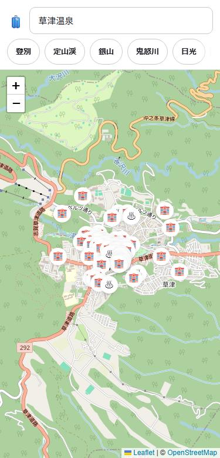
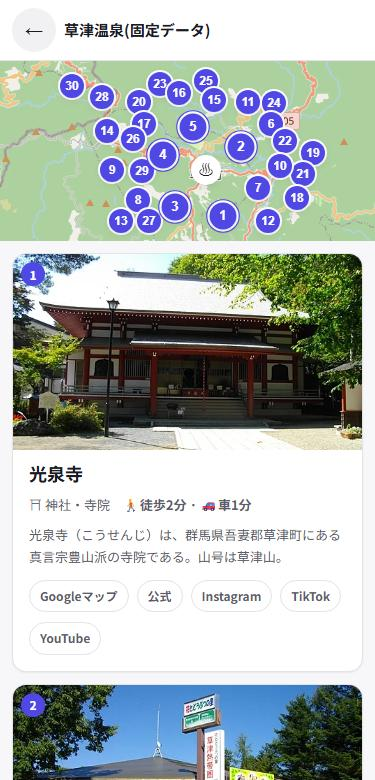
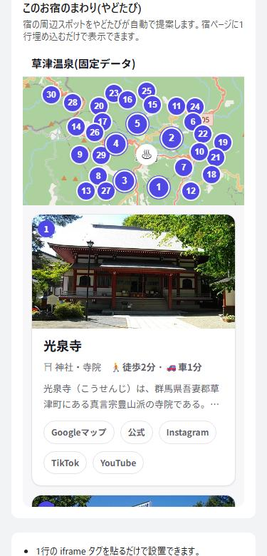

# やどたび (v3)

**What this is**: Yadotabi is a static, mobile-first web app that suggests nearby sights around a hotel from just its coordinates — no user input required. **How to try**: open `https://teer-tee.github.io/yadotabi/`, or add `?fixture=` with `kusatsu` / `hakone` / `dogo` / `beppu` / `kinosaki` (or `random` to pick one at runtime) to see a demo with no external API calls; add `&debug=1` alongside `?fixture=` to also show the rank score breakdown on each card. **Embedding**: add `?embed=1` together with `?hotel=` to show only the mini map and the feed, sized for pasting into a hotel's own booking page as an iframe (height auto-resizes). **No API keys needed**: it only uses free public APIs (OpenStreetMap / Overpass / Wikipedia), at zero cost. See the parameter table below (in Japanese) for the full list.

**Demo for hotels / OTAs**: see how it looks embedded in a hotel's own page — [English](https://teer-tee.github.io/yadotabi/demo/hotel-page-en.html) / [日本語](https://teer-tee.github.io/yadotabi/demo/hotel-page.html)

<table>
  <tr>
    <td align="center"><br>①宿を選ぶ</td>
    <td align="center"><br>②周辺が流れてくる</td>
    <td align="center"><br>③他サイトに埋め込める</td>
  </tr>
</table>

宿を選ぶだけ。ボタンも設定もなし。地図の宿ピンをタップするか、検索欄に名前を打って候補をタップするだけで、その宿の周辺のおすすめスポットが写真つきカードでどんどん流れてくるスマホファーストの静的Webアプリです。泊数や移動手段を選ばせたり、「行った!」を押させたりする操作は一切ありません。

## 起動方法

1. `start-server.bat` をダブルクリックする
2. 自動でブラウザが開き、`http://localhost:3000` が表示される
   (開かない場合は手動でブラウザを開いてこのURLにアクセスしてください)

※ 初回はNode.jsのパッケージ `serve` を一時的にダウンロードするため、少し時間がかかることがあります。

## 使い方

宿を選ぶ入口は3つあります。どれを使っても、選んだ瞬間に周辺提案フィードの画面に切り替わります。

1. **地図の宿ピンをタップする**: 最初に開くと地図(初期表示は草津温泉)が出て、表示範囲内の宿・旅館が自動でピン表示されます。地図を動かすとその範囲の宿を取り直します。ピンをタップするだけで選択完了です。
2. **検索欄に打って候補をタップする**: 上部の検索欄に宿名やエリア名を打つと、打つそばから候補が一覧で出ます。宿の候補をタップすれば選択完了、地名の候補をタップすると地図がそこへ寄ります(選択にはなりません)。検索欄をフォーカスすると、直前に選んだ「最近の宿」も候補として出ます。
3. **URLで直接指定する**: `?hotel=<緯度>,<経度>,<宿名>` を付けてアクセスすると、その宿を選んだ状態で直接フィード画面が開きます。`?q=<エリア名>` を付けると、そのエリア名で検索して地図を寄せた状態(宿の選択はしない)で開きます。`?fixture=hakone`(または `kusatsu` / `dogo` / `beppu` / `kinosaki`)を付けると、外部APIを叩かずに保存済みの固定データでフィード画面を再現します(撮影・検証用)。

その他の操作:
- 画面上部の「草津」「伊香保」「箱根」などの**エリアチップ**をタップすると、その温泉地へ地図が飛びます。
- フィード画面の左上の「←」で地図(宿を選ぶ画面)に**戻る**ことができます。
- フィード内のカードが車で1時間を超える距離の場合は、フィードには出さず「**もっと遠く**」という折りたたみに静かにまとめられます。
- 車で60分以内でも遠いものはフィードの後方に並びます。○△×のような合否表示はありません。

**他サイトへの埋め込み(`?embed=1`)**: `?embed=1` を `?hotel=` と一緒に付けると、検索欄・エリアチップ・宿を選ぶ地図・戻るボタンを隠し、**小地図と提案フィードだけ**の表示になります。宿の予約ページに「周辺の見どころ」として iframe で貼る用途を想定しています。高さは自動で伸びます(`postMessage` で親へ通知、受信側コードは `demo/hotel-page.html` を参照)。

```html
<iframe src="https://teer-tee.github.io/yadotabi/?embed=1&hotel=36.6226,138.5960,草津温泉"
  style="width:100%;max-width:420px;height:720px;border:1px solid #ddd" title="やどたび"
  sandbox="allow-scripts allow-same-origin allow-popups allow-popups-to-escape-sandbox" referrerpolicy="no-referrer"></iframe>
```

`sandbox` は貼り先とやどたびが**別オリジン**(別ドメイン)のときに効く保護です。同じオリジンに置くと `allow-same-origin` により実質無効になります(無害ですが保護にもなりません)。

`sandbox` のトークンを削ると何が壊れるか(2026-09-16実測、`demo/hotel-page.html` 参照): `allow-same-origin` を外すと fixture のデータ取得が CORS で落ち localStorage も SecurityError になる(カード0枚) / `allow-popups` 系を外すとカードの「行き方」等の外部リンクが反応しなくなる / `sandbox` は貼り先とやどたびが**別オリジン**のときに効く保護で、同じオリジンに置くと `allow-same-origin` により実質無効になります(無害ですが保護にもなりません)。

`?embed=1` だけで宿の指定が無いときは、通常どおり宿を選ぶ画面が出ます(空白になりません)。ローカルでの見え方は `demo/embed-check.html` で確認できます。

営業用デモ: `demo/hotel-page.html`(本番URL https://teer-tee.github.io/yadotabi/demo/hotel-page.html )。予約サイト風の架空の宿ページに埋め込みモードを iframe で置いた1枚で、予約サイト運営者への説明資料として使えます。英語版 `demo/hotel-page-en.html`(本番URL https://teer-tee.github.io/yadotabi/demo/hotel-page-en.html )も用意しており、海外の予約サイト運営者への説明にも使えます。

## 用語ミニ辞典

このREADMEに出てくる、初心者には馴染みが薄いかもしれない言葉をまとめました。

| 用語 | 読み方・意味 | このアプリでの役割 |
|---|---|---|
| fixture | フィクスチャー(固定データ) | `?fixture=kusatsu` のように使うと、外部APIを叩かずに保存済みの応答データで画面を再現できる(撮影・検証用) |
| Overpass | オーバーパス(OpenStreetMapのデータを検索できる無料サービス) | 宿の位置や周辺の観光地・施設情報を取得するのに使う |
| geosearch | ジオサーチ(座標を指定して近くの記事を探すWikipediaの機能) | 宿の周辺にあるWikipedia記事とその写真・要約を探すのに使う |
| OSM | オーエスエム(OpenStreetMapの略。誰でも編集できる無料の地図データ) | 地図タイル・宿や施設の位置情報の出どころ |
| embed | エンベッド(埋め込み) | `?embed=1` を付けると検索欄などを隠し、他サイトにiframeで貼りやすい表示になる |
| rank | ランク(並べる・順位付けする) | 提案エンジンの中で候補をスコア順に並べ替える処理(`engine.js` の一部) |
| collect | コレクト(集める) | 提案エンジンの最初の段階。OSMとWikipediaの候補を集めて重複をまとめる処理 |
| present | プレゼント(整形する) | 提案エンジンの最後の段階。候補を写真・要約付きのカードに仕上げる処理 |
| Wikipedia | ウィキペディア(誰でも編集できる無料の百科事典) | 周辺スポットの写真・要約・記事リンクの出どころの一つ |
| Nominatim | ノミナティム(OpenStreetMapの無料ジオコーディングサービス) | 検索欄に打った文字から宿名・地名の候補を探すのに使う |

## 仕組み(かんたん解説)

- **宿の取得**: [Overpass API](https://overpass-api.de/)(OpenStreetMapのデータを検索できるサービス)を使い、地図の表示範囲内にあるホテル・旅館・ゲストハウスなどを取得してピン表示しています。
- **候補検索**: 検索欄に打った文字は [Nominatim](https://nominatim.openstreetmap.org/)(OpenStreetMapの無料ジオコーディングサービス)に投げて、宿名・地名の候補を即時に取得しています。
- **周辺スポットの取得**: 宿を選ぶと、Overpass APIで周辺の観光地・施設情報を、日本語版Wikipediaの周辺記事検索(geosearch)で近くの記事とその写真・要約を、それぞれ並行して取得し、1つの候補リストに統合しています。Wikipedia側は1回のgeosearchでは取り切れない範囲を補うため、同じ中心から半径3km/6km/10kmの同心円3段に分けて呼び、pageidで重複を除いてマージしています(本番のみ。fixtureモードは保存済みデータをそのまま使うため1回)。片方のAPIが失敗しても、取れた方だけでフィードを作ります。
- **段階描画**: OSM側の解決が先に終わった時点で最初のカードを先に出し、Wikipedia側の到着を待たせません(`?slow=osm800,wiki1500` のようにURLパラメータで遅延を指定すると、誰でもこの段階描画を再現できます)。
- **重複マージ**: 表記違いで別々に取れた同一地点(例: 「湯畑源泉」と「湯畑」)は1件にまとめ、短い方の名前を代表として残します。OSM要素の `wikipedia`/`wikidata` タグがあればそれも使ってWikipedia側と突き合わせます。ただし名前が一部一致するだけでは同一視せず、差分が別施設を示す語(足湯・バスターミナル等)なら別物として区別しています。
- **除外ルール**: 学校・病院・役所・気象台・停留場・信号場など観光対象ではない候補は名前から判定して除外しています。「記念館・資料館・美術館・博物館・道の駅・公園・神社・寺・城・滝」等で終わる名前は誤って除外されないよう先に保護判定してから除外ルールを適用します(OSM側・Wikipedia側の両方に適用)。
- **提案エンジン(`engine.js`)**: 「**集める(collect)→並べる(rank)→整形する(present)**」の3段構成になっています。collectでOSMとWikipediaの候補を集めて重複を1つにまとめ、rankでスコア順に並べ替え、presentで写真・1行要約・徒歩/車の分数・外部リンク付きのカードに整形します。
  - **正直な注意点**: `rank()` は現状まだ暫定実装です。Wikipediaに記事や写真がある場所、公式サイトがある場所を優先的に上位へ出すロジックのため、結果はどうしても有名な観光地に偏ります。「まだ知られていない穴場を見つけて出す」ためのアルゴリズムは今後の研究課題であり、`rank()` はそのために差し替えやすいよう1関数に閉じ込めてあります。
- **受動ログ**: 「行った!」のような操作は求めず、どのカードがタップされたか・どこまでスクロールされたかを端末内の `localStorage`(`yado.passive.v1`、上限200件)にだけ記録しています。送信は一切しません。詳細は `docs/passive-log.md` を参照してください。

すべて無料のオープンデータ・サービスを使っており、npm installやビルドは不要です。ブラウザで `index.html` を開くだけで動く素のHTML/CSS/JavaScriptで作られています。

## 判断待ちの設計課題

作りかけを隠さないために、まだ決めていない設計上の論点をそのまま公開しています。

- **検索候補とエリアチップの重なり**: 解決済み(2026-09-18 R2-1)。候補が開いている間は `.chips`/リード文/サンプル行を `visibility:hidden` で隠す方式を採用した(`assets/style.css` の `pickbar--suggesting`)。
- **カテゴリ多様性の減点が有名どころを締め出す**: 箱根では attraction 118件・museum 109件が競合し、カテゴリの偏りを抑えるための減点 `18×(n-2)` が上限なく積み上がります。大涌谷は−72、彫刻の森美術館は−108の減点を受け、距離加点や2ソース一致 +20 では相殺できず上位30枚に入りません。近場の無名スポットが先にカテゴリ枠を埋めてしまうため、結果として有名どころほど不利になるという逆転が起きています。選択肢は (a) 減点に上限を設ける (b) Wikipedia記事があるものは減点を免除する (c) このままにする(「認知外のスポットを出す」という狙い通りとみなす)、の3つで未決です。
- **実APIとfixtureのWikipedia件数の食い違い**(2026-09-19 の再生成で前提が変わりました): かつては `fixtures/hakone.json` が50件(最遠3,720m)を保存する一方で実API実測は34件(最遠3,574m)にとどまり、「50件の上限で打ち切られている」という当初の前提が再現しない、という論点でした。**現在の hakone.json は再生成後で 326件を保存しており、50件という数字自体が現状と一致しません**(R230 で実測)。この論点を続けるなら、実APIとの比較から取り直す必要があります。
- **小地図のピンのずらし幅**: 小地図はピンが密集したとき、表示位置だけ最大96pxずらして番号を読みやすくしています(実際の座標そのものは書き換えていません)。180pxの小さな概観図であることから「正確さより見やすさ」を優先する方針ですが、厳密な位置確認はGoogleマップリンク側に任せてよいか、という点は未決です。

朝の相談の経緯は `docs/NIGHTLOG.md` の「朝の相談(判断が要るもの)」節を参照してください。

### 写真があるカードの割合(fixture 上位30件・2026-09-18 時点)

| エリア | 上位30件中 写真あり | 割合 |
|---|---|---|
| 草津 | 16件 | 53% |
| 箱根 | 11件 | 37% |
| 道後 | 11件 | 37% |
| 別府 | 11件 | 37% |
| 城崎 | 20件 | 67% |

写真が無いカードはカテゴリ絵文字のプレースホルダになる(R23)。ライトボックス(R66)が効くのは写真ありのカードのみ。なお「上位60件」は `?demo=` なしの `dump-rank.mjs` では取れないため未計測(上位30件のみ)。

## URLパラメータ一覧

`?fixture=` の詳細(area追加手順・生成方法)は [docs/FIXTURES.md](docs/FIXTURES.md) を参照してください。

| パラメータ | 値の例 | 何が起きるか | 外部APIを叩くか |
|---|---|---|---|
| `?hotel=` | `35.61,138.59,ホテル紅葉亭` | 緯度,経度,宿名(名前省略可)で「この宿の周辺」画面を開く | 叩く |
| `?q=` | `?q=草津` | エリア名で検索し地図を寄せる(宿の選択はしない。該当エリアチップを強調) | 叩く |
| `?fixture=` | `kusatsu` / `hakone` / `dogo` / `beppu` / `kinosaki` / `random` | 保存済みの生レスポンスで画面を再現する(`random` は5エリアから実行時に1つ選ぶ) | 叩かない |
| `?debug=1` | `?fixture=kusatsu&debug=1` | `?fixture=` と併用したときだけ有効。カードの下端に rank のスコア内訳(順位・source・カテゴリ・距離・合計と加減点の明細)を淡色の極小文字で出す。`?fixture=` が無ければ一切効かない | 叩かない |
| `?embed=1` | `?embed=1` | `?hotel=` か `?fixture=` と併用したときだけ有効。埋め込み表示に切り替える | 併用先に従う |
| `?bg=` | `?bg=fff7e6` | `?embed=1` と併用したときだけ有効。背景色を6桁の16進で指定し宿ページに馴染ませる(不正な値は無視)。**相対輝度が0.5未満の暗い色(例: `000000`)は地色に直接乗る淡色テキストが読めなくなるため無視され、既定の地色に戻る**(閾値0.5は淡色テキスト `--c-text-faint` #9494a3 が黒地でちらつく実測に基づく) | 併用先に従う |
| `?slow=` | `osm800,wiki1500` | OSM/Wikipediaの取得に人工遅延を入れ、段階描画を撮影しやすくする(1項目あたり上限10000ms) | 叩く(遅延するだけ) |
| `?perf=1` | `?perf=1` | 各段の所要時間を画面最下部と console に出す | 併用先に従う |
| `?simulate=overpass504` | `?simulate=overpass504` | Overpassだけ混雑(504)している状態を再現する | Overpassは叩かない(Wikipediaは叩く。fixture併用時は叩かない) |
| `?simulate=empty` | `?simulate=empty` | 提案0件の状態を再現する | 叩かない |
| `?demo=` | 下記「`?demo=`の値一覧」参照 | 撮影・検証用の画面状態を外部API 0回で再現する | 叩かない |

### `?demo=`の値一覧

12個すべて `assets/app.js` の `?demo=` 分岐で完結し、外部APIは叩きません(`autozoom` と `hoteltip` は
宿の取得関数をダミーデータに差し替えることで再現しています)。

| 値 | 何が再現されるか | 使っている検査 |
|---|---|---|
| `far` | 現在地から遠い提案がある状態 | check-a11y.mjs / check-feednote.mjs |
| `zoomout` | 地図の保存位置を復元しない状態(状態Aも同時に有効) | check-chipcurrent.mjs / check-keyboard.mjs / check-sample.mjs |
| `initpos` | 状態Aの初期位置の検査用(地図の保存位置を復元せず状態Aで開く。`zoomout` と同じ2フラグが立つ) | check-initpos.mjs |
| `suggest` | 検索候補が出ている状態A | check-chipcurrent.mjs / check-recent.mjs |
| `recent` | 最近見たエリアがある状態A | check-initpos.mjs / check-recent.mjs |
| `recentmix` | 最近見たエリアが複数混在する状態A | check-a11y.mjs / check-recent.mjs |
| `passive` | パッシブ通知(受け身の提案)が出ている状態 | なし(目視専用) |
| `imgfail` | 画像取得に失敗したときのフォールバック表示 | check-imgfail.mjs |
| `portrait` | カード先頭3枚の写真を縦長ダミー画像(400×800)に差し替え、縦長写真の見切れを確認する | check-imgfail.mjs |
| `nohotels` | 状態Aで周辺に宿が1件もない状態 | check-autozoom.mjs / check-nohotels.mjs |
| `autozoom` | 宿0件→自動で1段引く→2回目で宿が見つかる、の自動ズーム挙動を再現(ダミーの宿データに差し替え) | check-autozoom.mjs |
| `hoteltip` | 状態Aで宿ピンが密集し、名前ツールチップが重なる見た目を確認する状態(ダミーの宿6件に差し替え) | check-hoteltip.mjs |

## ファイル構成

- `index.html` — 画面のHTML本体。地図で選ぶ「状態A」とフィードを見る「状態B」の2状態を1画面に持つ。
- `assets/app.js` — 画面本体。状態管理・地図表示・検索/エリアチップ/URLの3入口・フィード描画を担当する。
- `assets/geo.js` — 宿の取得・宿候補検索・周辺スポット取得・Wikipedia周辺記事取得などの外部API呼び出しとキャッシュを担当する。
- `assets/engine.js` — 提案エンジン本体。`collect`(集める)→`rank`(並べる)→`present`(整形する)の3段で候補をカードに変換する。
- `assets/style.css` — 画面全体のレイアウト・カードなどのスタイル。
- `assets/ui.css` — 検索欄・チップ・ボタンなど共通UI部品のスタイル。
- `assets/tokens.css` — 色・余白・フォントサイズなどのデザイントークン(共通の値の置き場)。
- `scripts/` — 開発用の検査スクリプト群(`check-*.mjs` と `check-all.mjs`)、および固定データを作る `make-fixture.mjs` など。
- `fixtures/` — `?fixture=` で使う保存済みの外部API応答データ(草津・箱根・道後・別府・城崎の5エリア)。固定データの作り方・再生成の判断基準は [docs/FIXTURES.md](docs/FIXTURES.md) を参照。
- `demo/` — 営業用デモページ(`hotel-page.html` など)や埋め込み確認用HTML。
- `docs/` — 計画書・研究ノート・自動継続ループの規約(AUTOPILOT/NEXT/NIGHTLOG/ROADMAP)・死活チェックスクリプトの置き場。

## 無料APIのマナー

このアプリは無料の公共APIに支えられています。使いすぎるとサービス側に迷惑がかかり、最悪アクセス禁止(BAN)になるので、次のマナーを守って使ってください。

- **Nominatim**: 1リクエスト/秒を超えないこと(連続検索を高速で繰り返さない)。
- **Overpass API**: 広い範囲や複雑すぎるクエリ(重いクエリ)を投げないこと。
- **OSM地図タイル**: 大量アクセス・自動巡回はしないこと。
- 混雑時は画面に「地図サーバーが混雑しています」というメッセージが出ます。Overpassが混雑(429/504)を返したときは3秒後に自動で1回だけ再試行し、それでも駄目ならWikipediaだけで提案を出します(画面が空になることはありません)。
- 同僚やもっと多くの人に使ってもらってアクセス数が増えてきたら、地図タイルなどを商用サービス(有料)に切り替えることを検討してください。

本番の死活チェックは GitHub Actions で毎日自動実行しています(`.github/workflows/check.yml`)。

## GitHub Pages 公開手順(初心者向け)

同僚に触ってもらうために、無料でWeb公開できる「GitHub Pages」を使います。PowerShellで以下を実行してください。

1. GitHubで空のリポジトリ `yadotabi` を作成する(READMEなどは追加しない「Empty repository」で作成)
2. このフォルダでリモートを設定してpushする

   ```powershell
   git remote add origin https://github.com/<あなたのGitHubユーザー名>/yadotabi.git
   git push -u origin main
   ```

3. GitHubのリポジトリページで `Settings` > `Pages` を開く
4. `Source` を `Deploy from a branch` にし、ブランチを `main` / フォルダを `(root)` にして `Save`
5. 数分待つと `https://<あなたのGitHubユーザー名>.github.io/yadotabi/` でアクセスできるようになる

### 更新するとき

コードを直したら、次の2つのコマンドだけでOKです。

```powershell
git add -A
git commit -m "変更内容を1行で"
git push
```

### 同僚に共有するときの注意

「最近の宿」の記録や検索キャッシュは各自の端末の `localStorage` にしか保存されません。同僚に公開URLを共有しても、あなたの記録が見えたり、記録がみんなで共有されたりすることはありません(それぞれの端末で個別に記録されます)。

## 開発者向け

検査を回すには **Node.js と Python 3** が必要です(`scripts/lib/server.mjs` がローカル確認用のサーバを `python -m http.server` で起動するため)。本番サイトを見るだけなら何も要りません。

`node scripts/check-all.mjs` を実行すると、`scripts/check-*.mjs` の34本と `docs/check.mjs` の1本、計35本を1コマンドで直列実行し、結果を表(PASS/FAIL・所要時間)で確認できます。1本でも失敗すると exit code 1 で終了します。検査はローカルサーバを内部で立ち上げますが、そのサーバは Node.js の子プロセスとして `python -m http.server` を起動しています。そのため検査の実行には別途 Python 3 のインストールが必要です(アプリ本体をブラウザで開くだけなら不要)。

「もっと遠く」に振り分ける far の閾値(`FAR_DRIVE_MIN`、車60分超)は 60分×500m/分＝30km で、`scripts/make-fixture.mjs` の収集半径(`osmRadiusM`)とは独立に決まっている定数です。収集半径が30kmに満たないエリアでは far が構造上0件になる点に注意してください(実測は [docs/FIXTURES.md](docs/FIXTURES.md) の「far 実測表」を参照)。

`node scripts/check-all.mjs` が何を実行しているかの一覧は [docs/CHECKS.md](docs/CHECKS.md) を参照してください(35本の検査それぞれが何を検査するか・サーバを立てるか・所要目安と、並列化できない理由をまとめています)。

### fixtures のファイルサイズ

`fixtures/*.json` の実測値です(2026-09-19 生成・5エリア。R14前の列は当時の記録として残しています)。

| エリア | osmRadiusM | OSM elements | Wikipedia pages | ファイルKB | R14前 |
|---|---|---|---|---|---|
| kusatsu(草津温泉) | 15,000 | 189 | 50 | 112.4 KB | 65.3 KB |
| hakone(箱根湯本) | 15,000 | 1,135 | 326 | 320.9 KB | 900.1 KB |
| dogo(道後温泉) | 15,000 | 463 | 338 | 231.3 KB | 117.1 KB |
| beppu(別府温泉) | 15,000 | 667 | 142 | 206.8 KB | 172.7 KB |
| kinosaki(城崎温泉) | 15,000 | 455 | 99 | 131.5 KB | -(R81で生成時に軽量化済み) |

- **収集半径は5エリアとも 15,000 で同じです。** 以前は hakone だけ 30,000 でしたが、R176 で他エリアに揃えました(古い README に「hakone だけ半径が広いから大きい」と書いてあったのはこの変更前の話です)。
- **hakone が最大(320.9 KB)なのは、半径ではなく同じ半径の中に入る対象物の数が多いためです。** hakone は OSM 要素が 1,135件と5エリア中で最多(他は189〜667件)で、ファイル内訳でも OSM 部分が 144.1 KB と突出しています(他エリアは 23.5〜83.1 KB)。つまり箱根は同じ 15km 圏内に登録済みの施設がもともと多い土地だ、というだけのことです。
- **ファイルサイズは OSM 要素数だけでは決まりません。** ファイルは OSM 部分と Wikipedia 部分の合計でできており、dogo は OSM 要素が 463件(hakone の4割)ながら Wikipedia 記事が 338件と5エリア中で最多で、Wikipedia 部分が 109.7 KB と hakone(99.5 KB)より大きく、全体でも 231.3 KB と2番目になります。**OSM 要素数だけを見ると大小を読み違えるので、両方を見てください。**
- Wikipedia の記事数はエリアによって 50〜338件と幅があります(`make-fixture.mjs` の geosearch は `ggslimit=500` で取得するため、上限ではなくその土地に実在する記事数がそのまま出ます。kusatsu の 50件はたまたまの実数です)。
- R14 の keep-list 除去で当時のファイルは 30〜35% 縮みました。詳細は [docs/FIXTURES.md](docs/FIXTURES.md) を参照してください。

## v1 からの変更点

- ホテル名・泊数・移動手段を入力させるUIをすべて廃止。宿を選んだ瞬間に提案が出る仕組みに変更(入力ゼロ)。
- プラン作成ロジックの `planner.js` と「行った!」記録の `visits.js` を削除。プラン作成は提案エンジン `engine.js` の `rank()` に統合。
- 「定番/発見」「行った!」ボタンなどの○△×的な合否表示を廃止。遠いものは「もっと遠く」に静かに回すだけにした。

## 今後(計画v3/研究ノート参照)

詳細は計画書 `08_計画v3_ホテルを選んだら出る.md` と `09_研究ノート` を参照してください。

- **穴場アルゴリズムの研究**: 現状の `rank()` が有名どころに偏る問題を継続的に研究し、差し替えを検討する。
